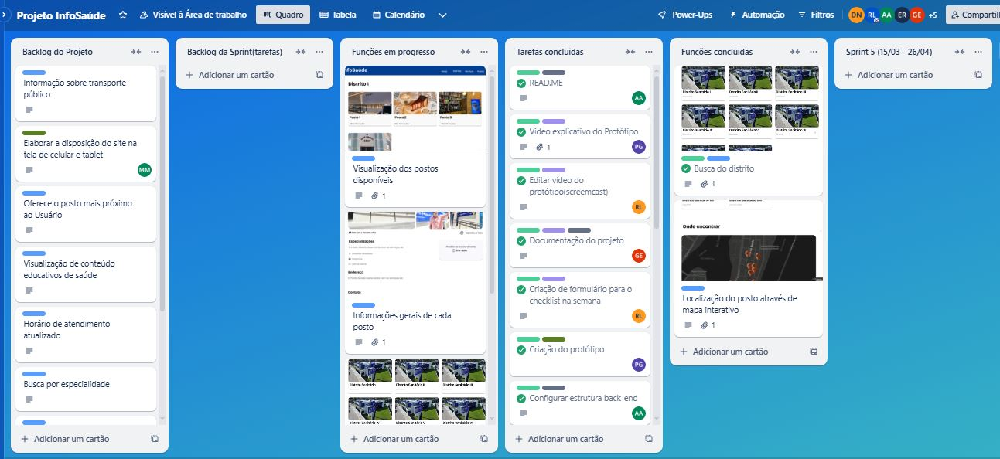
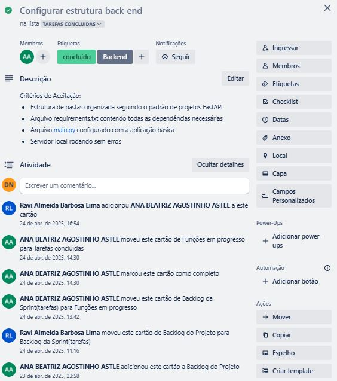
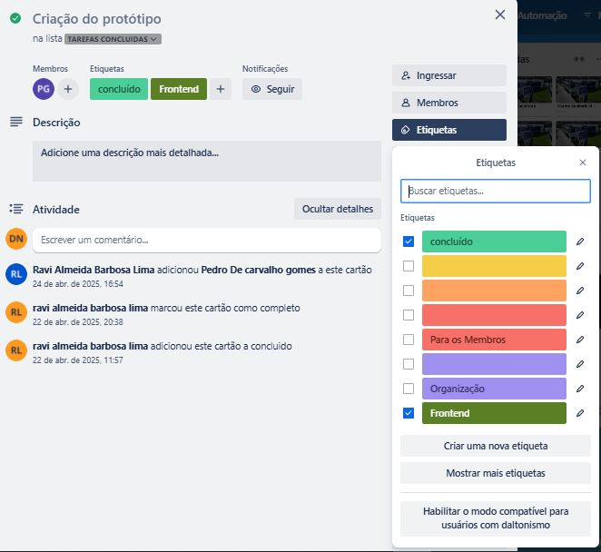

# InfoSaúde Recife

## 📌 Sobre o Projeto
A InfoSaúde Recife é uma plataforma digital que está sendo desenvolvida para facilitar o acesso a informações sobre os serviços de saúde pública. Nosso objetivo é otimizar a busca por atendimento, minimizando deslocamentos desnecessários, otmizando a distribuição da demanda nos postos de saúde e melhorando a experiência dos usuários.

A plataforma permitirá a consulta rápida e intuitiva das unidades de saúde disponíveis, oferecendo informações organizadas e acessíveis.

___

## 🛠 Tecnologias Utilizadas

 
    
Clique para expandir

- 
- 
- 
- 
- 
- 
- 

___

## 📖 Entrega 1

    
Clique para expandir

### Backlog

___

## 📖 Entrega 2

    
Clique para expandir

### 1. Visão Geral do Quadro

### 2. Exemplo de User Story Detalhada

### 3. Progresso das Tarefas na Sprint

### 4. Organização de Responsáveis

___

## 🔗 Recursos do Projeto

- **Gerenciamento:**
    - [Jira](https://id.atlassian.com/login?continue=https%3A%2F%2Fid.atlassian.com%2Fjoin%2Fuser-access%3Fresource%3Dari%253Acloud%253Ajira%253A%253Asite%252Fe4a1ea6d-37a4-470a-aa3d-77820f3886a5%26continue%3Dhttps%253A%252F%252Fcesar-team-zmqyt8fg.atlassian.net%252Fjira%252Fsoftware%252Fprojects%252FKAN%252Fboards%252F1%253Fassignee%253Dunassigned%25252C712020%25253A41db834d-0f03-4c46-a2d3-3b7b468d8f16&application=jira)

- **Apresentação:**
    - [Slides da Apresentação](https://www.canva.com/design/DAGCmpua3MQ/To3bhs9X5exntfk9QRJk5Q/edit?utm_content=DAGCmpua3MQ&utm_campaign=designshare&utm_medium=link2&utm_source=sharebuttonhttps://www.canva.com/design/DAGCmpua3MQ/To3bhs9X5exntfk9QRJk5Q/edit?utm_content=DAGCmpua3MQ&utm_campaign=designshare&utm_medium=link2&utm_source=sharebutton)

- **Demonstração:**
    - [Screencast](https://drive.google.com/file/d/1X53gyZxotaYsbJRWsbnN4iZYeIEC44rE/view?usp=drive_link)
___

## JUSTIFICATIVA DO NÃO USO DA PROGRAMAÇÃO EM PARES:

  
    
Clique para expandir

No contexto do Projeto InfoSaúde, optamos por não adotar a técnica de Programação em Pares devido à natureza multidisciplinar e acadêmica do time, bem como pela divisão prática de funções.
O foco principal do projeto esteve voltado para a construção de um protótipo funcional e um fluxo claro de navegação e informações, com ênfase em design de solução, pesquisa de usuário e estruturação de conteúdo — mais do que no desenvolvimento de software propriamente dito.
Como a maior parte das tarefas de desenvolvimento envolveu criação de artefatos simples (páginas HTML estáticas, linguagem back-end básica, documentação, estrutura de navegação) em vez de códigos complexos que exigissem lógica colaborativa intensa, a adoção de Programação em Pares não se justificaria em termos de ganho de produtividade ou qualidade técnica.
Além disso, o time priorizou a autonomia individual na execução de microentregas específicas (como a criação de fluxogramas, testes de usabilidade, e construção de telas) para garantir agilidade no cumprimento de prazos curtos e dinâmicos, típicos de projetos acadêmicos com datas de entrega fixas.
Caso o projeto evoluísse para uma fase de desenvolvimento mais robusta — por exemplo, com a integração de banco de dados, uma linguam back-end mais complexa e interfaces dinâmicas —, a prática de Programação em Pares seria considerada como uma estratégia para aumento de qualidade de código e redução de bugs.

Fatores e Justificativas:

Natureza do projeto	- Mais protótipo, menos software robusto;

Tipo de tarefas	- Simples, mais front-end básico e estrutura com back-end simples;

Organização da equipe - Divisão por microentregas para ser mais ágil;

Prioridade - Cumprir prazos de maneira leve e prática. Agilidade individual para cumprir prazos;

Visão Futura - Em projetos mais técnicos e sistemas mais complexos, a Programação em Pares poderá ser incorporada;

Back-end simples - Não exigiu codificação complexa que justificasse Programação em Pares.

____

## Justificativa da Escolha da Ferramenta Trello

    
Clique para expandir

Para a gestão do projeto InfoSaúde Recife, optamos pelo uso do Trello como ferramenta principal de organização das atividades e acompanhamento das entregas. A decisão foi baseada nos seguintes fatores:

Facilidade de Uso e Acessibilidade: O Trello é uma plataforma intuitiva, que possibilita a colaboração remota da equipe de maneira simples e eficiente, atendendo às necessidades de times multidisciplinares e de projetos acadêmicos.

Metodologia Ágil (Scrum): O Trello permite a estruturação de quadros que simulam fluxos ágeis, como o Scrum, que foi a abordagem metodológica adotada pelo projeto. Os cartões representam tarefas (User Stories), os checklists indicam critérios de aceitação e os quadros são organizados em colunas que refletem o progresso das atividades (Backlog, To Do, Doing, Done).

Transparência e Rastreabilidade: A ferramenta proporciona visibilidade total sobre o andamento do projeto para todos os membros da equipe, facilitando a rastreabilidade das atividades realizadas e o gerenciamento do tempo de execução de cada etapa.

Integrações e Extensibilidade: A compatibilidade do Trello com outras ferramentas (como Google Drive e Slack) facilita a centralização de documentos, discussões e versões de artefatos desenvolvidos.

Custo-Benefício: Para o estágio atual do projeto, o Trello oferece uma versão gratuita que atende plenamente às necessidades, eliminando custos adicionais.

___

##Diagrama de Atividades

prints/diagrama_atividades.jpg
___

## 👥 Nossa Equipe

- Ana Beatriz Astle
- Denise
- Eduardo de Medeiros Rocha
- Gustavo Magina
- João Victor Astle
- Maria Luiza Melo
- Pedro Gomes
- Ravi Barbosa
- Vinicius Cardoso
